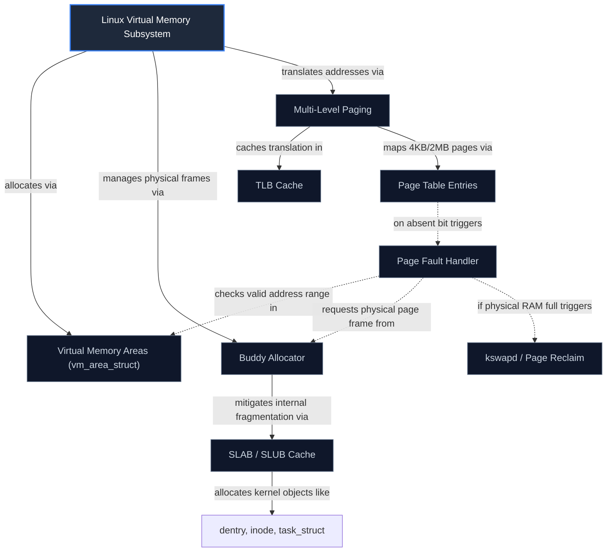

# mind-maps

## Core Philosophy
A mind map is not an artistic doodle or an unconstrained brainstorm web; it is an externalized spatial model of cognitive semantic memory. Linear text forces knowledge into a 1-dimensional sequential stream, masking hierarchical dependencies and lateral cross-domain connections. Effective mind mapping—and its formal sibling, the Novakian concept map—radiates outward from a central core problem, establishes labeled propositional relationships between nodes, clusters concepts by semantic hierarchy, and deliberately exposes conceptual voids where understanding has gaps.

---

## 4-Step Mind & Concept Mapping Framework

### Step 1: Central Anchor & Radiant Semantic Hierarchies
1. **The Core Anchor**:
   - The center node must not be a vague word (e.g. *"Physics"*); it must represent a specific architectural system or governing inquiry:
     - *"Linux Virtual Memory Subsystem"* or *"Mechanisms of Antibiotic Resistance"*.
2. **Radial Hierarchy (Chunking Principle)**:
   - Primary Branches (Tier 1): 4 to 7 fundamental operational pillars (respecting Miller's Law $7 \pm 2$).
   - Secondary Branches (Tier 2): Concrete mechanisms, sub-modules, or governing laws.
   - Tertiary Leaves (Tier 3): Specific empirical parameters, data structures, or code symbols.

### Step 2: Labeled Propositional Relationships (Novak Standard)
1. **The Proposition Rule**:
   - A bare line between two circles conveys zero meaning. Every edge must feature a **linking phrase / directional predicate**:
     - `[Virtual Memory]` --*translates addresses via*--> `[Page Table]`
     - `[Page Table]` --*caches lookups in*--> `[TLB (Translation Lookaside Buffer)]`
     - `[TLB]` --*on miss triggers*--> `[Hardware Page Table Walk]`
2. **Triangular Propositions**:
   - Any two connected nodes plus their linking verb must read aloud as an intelligible sentence: `Node A + Verb + Node B`.

### Step 3: Lateral Cross-Links & Graph Density
1. **Cross-Domain Synthesis**:
   - Draw explicit dashed connectors across disparate branches to highlight feedback loops, trade-offs, or shared bottlenecks.
2. **Graph Density Calibration**:
   $$D = \frac{2|E|}{|V|(|V|-1)}$$
   - A graph with high node count $|V|$ but near-zero cross-edges $|E|$ is merely an indented list rendered as circles. True systems mastery emerges when cross-branch density reveals systemic interplay.

### Step 4: Diagnosing Conceptual Voids (The Blank-Space Audit)
1. **The Structural Gap Scan**:
   - Examine the perimeter leaves:
     - Are there orphaned leaves with no downstream consequences?
     - Are there symmetrical subsystems where one side has 12 leaves and the other has only 1?
     - The missing nodes represent the boundaries of your knowledge—use them as targeted study queues.

---

## Deliverable Format: Markdown / Mermaid Knowledge Graph Syntax

---

## Worked Example: Mapping a Complex Distributed Architecture

- **Problem**: A software team struggled to understand the cascading failure modes in their microservices payment pipeline.
- **Intervention**:
  1. Drafted a radial concept map centering on `Payment Transaction Authorization`.
  2. Mapped 4 main branches: `Auth Service`, `Fraud Engine`, `Payment Gateway Adapter`, and `Ledger Event Bus`.
  3. Identified a missing lateral cross-link: when the `Payment Gateway Adapter` experienced 504 timeouts, the `Auth Service` hung indefinitely because it lacked an exponential backoff circuit breaker.
- **Outcome**: The visual cross-link gap led directly to the implementation of Resilience4j circuit breakers, preventing a recurring $40,000/hr downtime outage.

---

## Verification Checklist

- [ ] Central root node clearly defines a bounded topic or inquiry.
- [ ] Primary radial branches limited to 4-7 core operational pillars.
- [ ] Every connecting edge possesses a descriptive directional verb/predicate.
- [ ] Lateral cross-links connect concepts across different primary branches.
- [ ] Asymmetries and blank spaces identified for follow-up research.

---

## Anti-Patterns

- **The Monolithic Radial List**: Branching 40 un-categorized leaves directly off the central node like spokes on a bicycle wheel.
- **Unlabeled Lines**: Drawing lines between circles without verbs, making the nature of the relationship impossible to decode.
- **Aesthetic Over-Decoration**: Spending 3 hours choosing pastel color palettes and finding clip-art icons instead of clarifying conceptual relationships.
